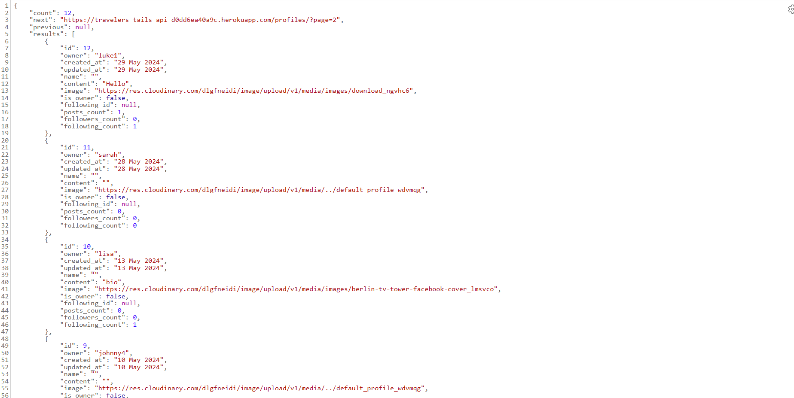

# Travelers Tails (Backend API)

Travelers Tails is a social media website aimed at travelers. It's purpose is centred around various traveler topics such as photos and videos of holidays, connecting with friends and community, and sharing your opinion on certain destinations. The goal of the project was to create a space that is interactive for the user so that they can better interact with their community, as well as share their own personal experiences.

This section will be focused on the Backend API, here is a link to the frontend React repository: https://github.com/Sean-OBrien95/travelers-tails-fe 

# Design

In this section I will cover the overall design choices of this project focusing on the backend.

## Design goals

The overall goal with the design of this project is to make it instantly recognisable what this project is about, create a space that is easy to understand and navigate where users can interact with the content posted as well as share their own videos and images, and share their opinions.

## Tools

This project was made using React, Django REST API, React-Bootstrap, and HTML/CSS

For this specific app, I used exclusively Django REST API along with a variety of packages such as Cloudinary, Cors, and Magic.

## Layout

This project has aimed to have a clear layout on both desktop and mobile, as well as medium sized screens. From the home page I wanted their to be an easy to understand nav bar at the top as well as a logo that makes it easy to understand the subject matter. It will then then go down into a search bar area for users to search by topic and have a search reault appear with all the post containing a key word search that also has an infinite scroll applied.

Under this the user will see the posts that have been created by users and this will also scroll infintely, there is an option to like but this action will only be able to be done if the user is logged in and they are not the owner of the post. The user will be able to see how many likes and comments a post has and be able to view the comments, but only leave one if they are also logged in. The posts will also have the country that the post was made in on top of the image video, and the users after can be clicked to be brought to their profile.

Depending on if the user is logged in or not this will change what the content of the nav bar are, if logged in they will have home, feed, notfications, and liked, as well as a create button to make new posts, where logged out users will have home, sign in, create account. This style will also change to a burger icon on smaller screens, except for create for logged in users which will be centred on the nav bar.

In the column to the right hand side will appear a box that shows the most popular accounts. If the user is logged in, each of these users will have a follow/unfollow button nect to them, depending on if the user is already following or not. When clicking these it will update the status and the button immediately. On smaller screens, this box will appear above the search bar and show the 4 most followed profiles, as well remove the follow/unfollow buttons as the styling of this did not match the rest of the site.

Next is the Create Account Page and the Sign In page. This pages are styled very similarly, and have a sunset location set as the background. On the create account page you are prompted to enter a username and fill in your password twice. If there are error such as mismatch password or a username that is already taken this will flag an error. If completed successfully, you are taken to the login page to fill in your credentials.

The next section is the Feed and the Liked sections, these are styled identically to the home page but for the feed will only show posts by users that you follow, and for the liked only show posts the user has already liked.

The next section is the notifications section, which will show the logged in user all the of the likes and comments they have received on posts. These are dispalyed in reverse chronological order and can be clicked to bring the user to the post that the notification is linked to. They will also be able to the see the notification senders username and profile avatar.

The profile section can be accessed through the nav bar for your own profile or by clicking another users profile to access theirs. These will be styled very similarly showing how many posts, followers, and following the user has as well as all of the posts they have made. If it is your account you will have the option to update bio and change username/password, and if it is another users you will have the option to follow/unfollow them.

Lastly is the create post section, this will give the user 4 fields to fill out being title, location, content, and upload image/video. For location specifically, a list of all countries will appear as well as a type function for the user to type in whichever country they are looking for to make navigation simple. This field is also identical to the edit post form.

# User Stories

- User Story 1: Create a Post
- As a user, I want to be able to create a new post with photos and other media content.

- User Story 2: User registration
- As a new user, I want to be able to register for an account with my username and password.

- User Story 3: Comment on a post
- As a user, I want to be able to comment on a post.

- User Story 4: View user profile
- As a user, I want to be able to view the profile of other users.

- User Story 5: User login
* As a registered user, I want to be able to log in to my account.

- User Story 6: Like a post
- As a user, I want to be able to like a post.

- User Story 7: Search posts
- As a user, I want to be able to search for other users or posts by keywords.

- User Story 8: View post feed
- As a user, I want to be able to view posts from users I follow in my feed.

- User Story 9: Follow/Unfollow a user
- As a user, I want to be able to follow or unfollow other users.

- User Story 10: Build notification app
- User should be able to send and receive notifications

# Home Page

- The home page of the api

* Featured on when you first open the app
* A simple welcome message that you can direct from there

# Posts page

- The posts page

* This the page where all of the recent posts are stored.
Any new post that is made by a registered user will have its information stored here
* In this page will see a clear layout of all the posts and their various information such as like_count, image, video, and location

# Comments page

- The comments page

* This is the the page where all of the comments will display
* Any comment that is made under a post will have its information stored here
* In this page you will see the list of comments, as well as all of their information such as owner, created at, post id, and profile id

# Followers page

- The followers page

* This section has will show all of the follows that have been made on the site
* Whenever a user follows another, this is where the information will be tracked
* In this page you will see information on each follow such as owner, create at, and followed

# Likes

- The likes page

* This section shows all of the likes made on the site
* When a user likes a post, this is where that information will be stored
* It contains information such as owner, create at, and post

# Notifications

- The notifications page

* This section will show all the notification made on the app
* When a user likes or comments on a post, the post owner will be notified and the information will be stored here
* It contains information such as sender, recipient, and post

# Profiles

- The profiles page

* This section is where all of the created profiles will display on the app.
* Anytime a new user is made they will be given a default profile image which can be updated later
* It contains information such as owner, image, and following count

# Future Features

- I have outlined future features that I would like to implement in the Frontend application which I am linking the repository to here: https://github.com/Sean-OBrien95/travelers-tails-fe

# API Fields

## Comment Model

### Fields
- **id**: AutoField (Primary Key)
- **owner**: ForeignKey (Relation to User model, on_delete=models.CASCADE)
- **post**: ForeignKey (Relation to Post model, on_delete=models.CASCADE)
- **created_at**: DateTimeField (Automatically set to the current date/time when the Comment is created)
- **updated_at**: DateTimeField (Automatically updated to the current date/time when the Comment is saved)
- **content**: TextField (Stores the content of the comment)

## Follower Model

### Fields
- **id**: AutoField (Primary Key)
- **owner**: ForeignKey (Relation to User model as the follower, related_name='following', on_delete=models.CASCADE)
- **followed**: ForeignKey (Relation to User model as the followed user, related_name='followed', on_delete=models.CASCADE)
- **created_at**: DateTimeField (Automatically set to the current date/time when the Follower instance is created)

### Meta Options
- **ordering**: List (Orders followers by the date they were created, newest first)
- **unique_together**: List (Ensures that a user cannot follow the same account more than once)

## Like Model

### Fields
- **id**: AutoField (Primary Key)
- **owner**: ForeignKey (Relation to User model as the liker, on_delete=models.CASCADE)
- **post**: ForeignKey (Relation to Post model, related_name='likes', on_delete=models.CASCADE)
- **created_at**: DateTimeField (Automatically set to the current date/time when the Like instance is created)

### Meta Options
- **ordering**: List (Orders likes by the date they were created, newest first)
- **unique_together**: List (Ensures that a user cannot like the same post more than once)

## Notification Model

### Fields
- **id**: AutoField (Primary Key)
- **recipient**: ForeignKey (Relation to User model representing the recipient of the notification, on_delete=models.CASCADE, related_name='notifications_received')
- **sender**: ForeignKey (Relation to User model representing the sender of the notification, on_delete=models.CASCADE, related_name='notifications_sent')
- **notification_type**: CharField (Indicates the type of notification, choices=('like', 'Like'), ('comment', 'Comment'))
- **post**: ForeignKey (Relation to Post model that the notification is related to, on_delete=models.CASCADE, blank=True, null=True)
- **created_at**: DateTimeField (Automatically set to the current date/time when the Notification instance is created)

## Post Model

### Fields
- **id**: AutoField (Primary Key)
- **owner**: ForeignKey (Relation to User model representing the owner of the post, on_delete=models.CASCADE)
- **created_at**: DateTimeField (Automatically set to the current date/time when the Post instance is created)
- **updated_at**: DateTimeField (Automatically updated to the current date/time when the Post instance is saved)
- **title**: CharField (Title of the post, max_length=255)
- **location**: CharField (Location of the post, max_length=100, choices=country_choice)
- **content**: TextField (Content of the post, max_length=5000)
- **image**: ImageField (Image attached to the post, upload_to='images/', default='../default_post_rgq6aq', blank=True)
- **video**: FileField (Video attached to the post, upload_to='videos/', blank=True, null=True, storage=VideoMediaCloudinaryStorage(), validators=[validate_video])

### Meta Options
- **ordering**: List (Orders posts by the date they were created, newest first)

## Profile Model

### Fields
- **id**: AutoField (Primary Key)
- **owner**: OneToOneField (Relation to User model representing the profile owner, on_delete=models.CASCADE)
- **created_at**: DateTimeField (Automatically set to the current date/time when the Profile instance is created)
- **updated_at**: DateTimeField (Automatically updated to the current date/time when the Profile instance is saved)
- **name**: CharField (Name of the profile, max_length=255, blank=True)
- **content**: TextField (Content of the profile, blank=True)
- **image**: ImageField (Profile image, upload_to='images/', default='../default_profile_wdvmqg')

### Meta Options
- **ordering**: List (Orders profiles by the date they were created, newest first)

# Testing

- Ran all python code through Python Linter, only error that came back were in the settings.py file for lines that were too long but I was not able to shorten these.

# Bugs

All bugs have been fully documented in my Frontend repository, which you can find here: https://github.com/Sean-OBrien95/travelers-tails-fe

# Automated Testing

To run automated tests I made 22 tests which have all passed and can be found in the tests.py files. I have also run a full coverage report which has come back at 93%

# Full Manual Testing

Full manual testing was completed on the frontend application, these tests will show how the information is handeled on the backend, eg, updating followers list etc. Link to frontend repository: https://github.com/Sean-OBrien95/travelers-tails-fe

## Deployment

* To deploy this project, I used Heroku, a cloud platform that allows you to easily host web applications.
* I navigated to Heroku and made sure that my app was hooked up to my Frontend application.
* Once this was done, I made sure that the config vars were set up correctly so that it would be able to interact with the frontend app.
* After this, I naviagted to the deploy page, and hit manual deploy.

Follow these steps to access the deployed version:

* Visit the deployed application: https://travelers-tails-api-d0dd6ea40a9c.herokuapp.com/
* You can explore the live version of the project to see it in action.

# Forking and Cloning

## Forking the Repository

To contribute to this project or create your own version, you can fork this GitHub repository. Forking creates a copy of the repository under your GitHub account. Follow these steps to fork the repository:

* Click the "Fork" button at the top right corner of this repository's page.
* This will create a copy of the repository under your own GitHub account.

## Cloning the Repository

To work with the code locally on your machine, you can clone the repository. Here's how:

* Open your terminal or command prompt.
* Navigate to the directory where you want to store the project.
* Run the following command to clone the repository:

git clone https://github.com/Sean-OBrien95/travelers-tails-api

# Credit

## Packages

* asgiref                         3.8.1
* cloudinary                      1.39.1
* coverage                        7.5.2
* dj-database-url                 2.1.0
* dj-rest-auth                    2.1.9
* dj3-cloudinary-storage          0.0.6
* Django                          5.0.3
* django-allauth                  0.44.0
* django-cloudinary-storage       0.3.0
* django-cors-headers             4.3.1
* django-filter                   24.2
* djangorestframework             3.14.0
* djangorestframework-simplejwt   5.3.1
* gunicorn                        21.2.0
* iniconfig                       2.0.0
* oauthlib                        3.2.2
* Pillow                          8.2.0
* pluggy                          1.5.0
* psycopg2                        2.9.6
* PyJWT                           2.8.0
* pytest                          8.2.1
* pytest-cov                      5.0.0
* python-magic                    0.4.27
* python3-openid                  3.2.0
* pytz                            2024.1
* requests-oauthlib               2.0.0
* sqlparse                        0.4.4

